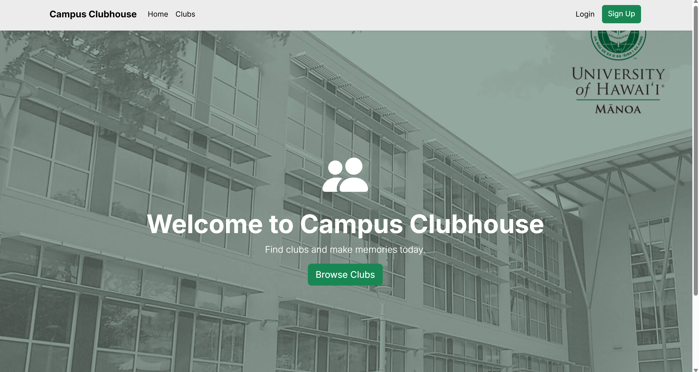
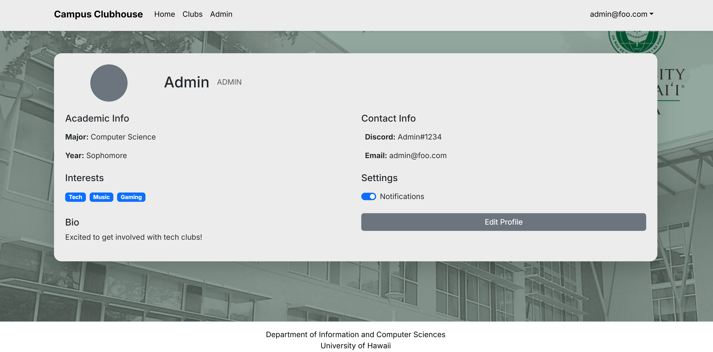
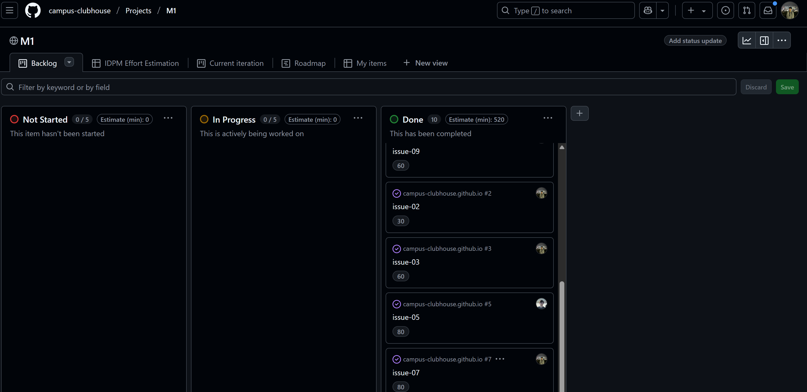

  

Campus Clubhouse is a mockup website created for a Final Group Project in ICS 314. 

It is designed to be an easy way for students to discover UH Mānoa's oficial and unoficial student clubs. 

The website uses a front end tech stack including a **Next.js** framework, a **PostgreSQL** database, and **Vercel** for deployment.

To learn more check out our github.io page here:

https://campus-clubhouse.github.io/

 

This project was a collaboritve effort with two other members. I was desginated the tasks of creating the landing page, and monitoring our github repos.

 

## Landing Page

  

This is the first page for users to see and will be the basis of design for the rest of the website. 

In terms of designing the UI, we wanted it to be simplistic. 

I've ran through a couple of different color coordinations and background images before finalizing the one pictured above.

 

## Profile Page

  

The profile page's main function is to be the place for users to monitor their roles (user, admin, super).

There is a notifications setting so users can be alerted about any changes regarding their role or the clubs they own.

The profile section also serves as a fun enhancement for all users to showcase who they are.

 

## Documentation

  

I was also issued to layout the github repos, projects, and deploy our app to vercel. 

Much of the learning experience took place here, as it would be the first time I've worked with github organizations / documentation. 

It was during this time in which we also began to learn IDPM, or issue driven project management. 

 

## Enhancements

This project was designed to be a mockup, but may be reusable for future uses. In this case there are amounts of enhancements that we have recognized.

Some key enhancements for future references:

**Connecting to the PostgreSQL database**
The database should contain a table with a list of signed in users, their roles and the clubs they potentially own.

**Feeding real data from a list of clubs (200+)**
The clubs being filled in can be created two ways. Either filled in using our add page created for club owners, or filled in by another list of clubs.

**Completing the "Super" role**
There should be a seperate page dedicated to the role which moderates all clubs and provides users their roles.

**Security**
There should be a seperate section in which security of the page can be discussed.

 

This final project was designed for us to test our development processes.
 
A lot of my personal learning definitely dipped more into the non-coding enviornment.  There was a lot more planning, communicating and deployment issues that I haven't thought about beforehand. 

It was also fun to collaborate with a team and have the opportunity to build with others. Even though much of our communication was aynchronous, it was definitely the best part of the project.

