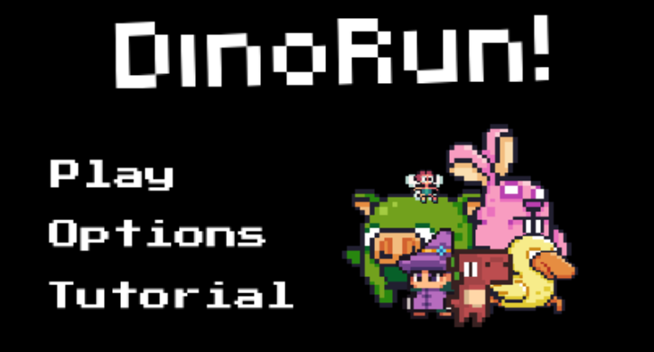
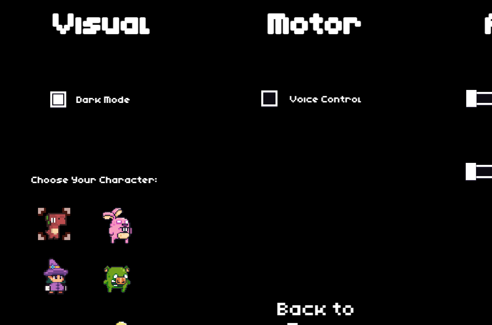

  

  
  

DinoRun is a simple game made for my SPED201 final project. It's a walkthrough on how developers can create applications whilst keeping accessibility in mind. It showcases visual, audio, and motor features all under the 'option' menu. The two most notable features of the game is it's character selection option, and a voice control option in which you can play the game using your voice.

It is implemented using a no coding game engine named GDevelop, although some JavaScript was used for some game mechanics. The sprites were taked from the game engine itself.

In this project I gained experience with accessibiltiy. A topic that is an undermined, but important in the way we create.

