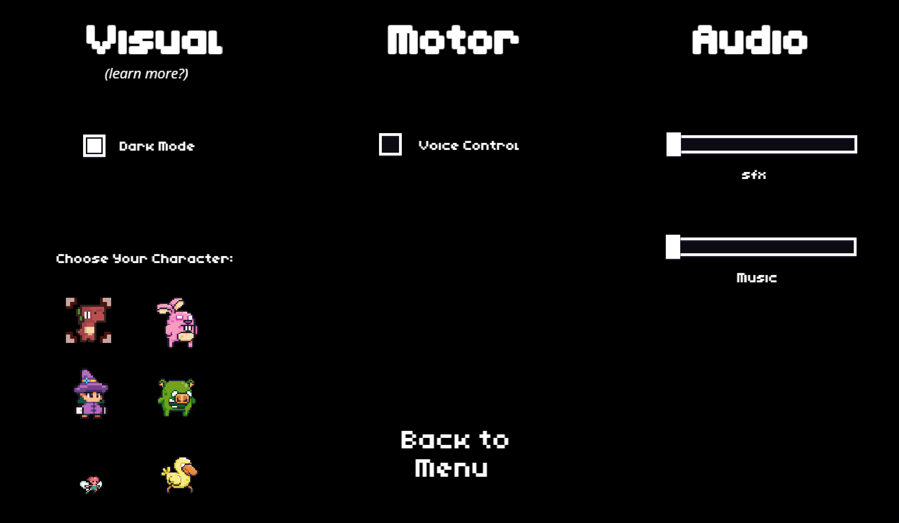
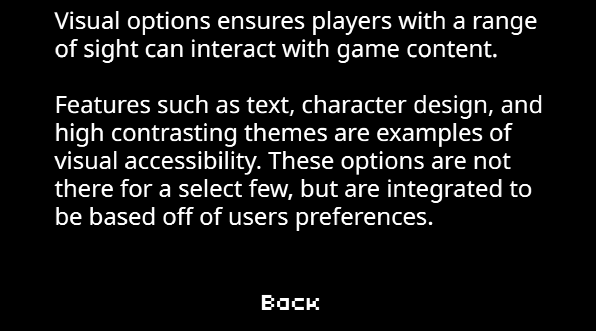

  

DinoRun is a simple game made for my SPED201 final project. It's designed to be a walkthrough on how developers can create gaming applications while keeping accessibility in mind. It showcases common  visual, audio, and motor features all under the option menu. 

 

  

 

The two most notable features of the game is it's character selection option, which is implemented as a visual accessibility option,and the voice control option in which you can play the game using your voice.

Upon hovering above the different accessibiliy option, a 'learn more' button will appear which directs you to a screen with more information regarding the chosen option.

 

  

 

In this project I gained experience with accessibiltiy. Research on how to produce usable applications that is inclusive to the most amount of people is a topic undermined, but important in the way developers create. 

If you are interested on this topic follow the link below to see my presentation slideshow that contains further information.
 

[Link to Accessibility in Video Games Slideshow](https://docs.google.com/presentation/d/1ms5po9lYsyh1mrPeyneh7JIElXhj_s4bb6N2_kQIM10/edit?usp=sharing)

[Link to Check out the Video Game](https://docs.google.com/presentation/d/1ms5po9lYsyh1mrPeyneh7JIElXhj_s4bb6N2_kQIM10/edit?usp=sharing)

 

  

