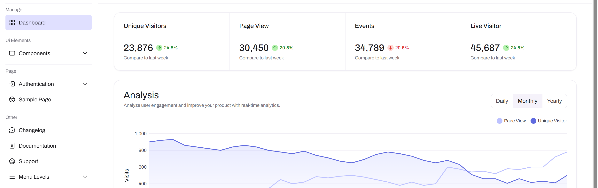

*Project is currently under development.*

The future development usage of 2.5ghz into 5ghz at the University of Hawaii Manoa is currently being researched by a graduate student of Manoa. I was asked to create a dashboard following their research, and for future usage under Netops. This dashboard will be used to store and update linear regressions models of network activity around campus. 

There are more than 250,000 data cells to be analyzed and distributed into the project's database. These linear regression models is hoped to be incoorperated with AI prediction models. 

As depicted by the client, the dashboard would be used as follows:

User begins in the landing dashboard which displays different data usages →
User clicks ‘Upload’ tab and is taken to the Upload page →
User drag and drops a datasheet file, the web application analyzes datasheet and stores new data, or updates preexisting data into database →
Web application undergoes a conversion script to convert data into a linear regression model →
Page refreshes to ‘Results’, where users may now examine and interact with the newly model chart, and other existing models as well.

 
Template of what is visually depicted.

  

 
