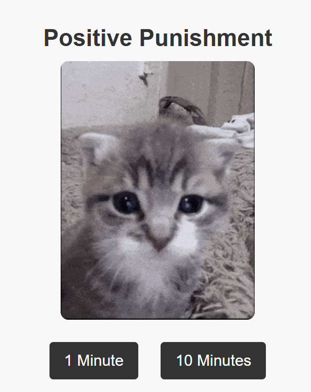
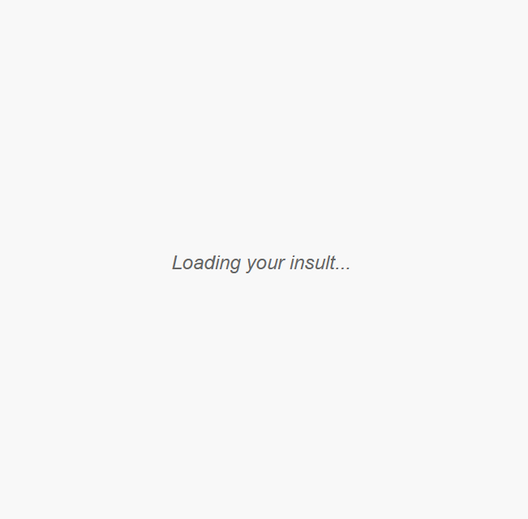

  

  

Positive Punishment is a simple chrome extension timer that generates AI made insults and cat images to help motivate students. 

The idea originated from my friend who needed honest and brutal motivation to push them to complete thier college assignments. 

  

It's layout components are made through HTML, CSS and JavaScript. The texts are pulled from a JavaScript API and the images are imported gifs.

The files are also accessible as a zip-file for anyone to plug in as their own custom chrome extension.

This was my first project incoorperating these languages and is under improvements currently. 

 

  

